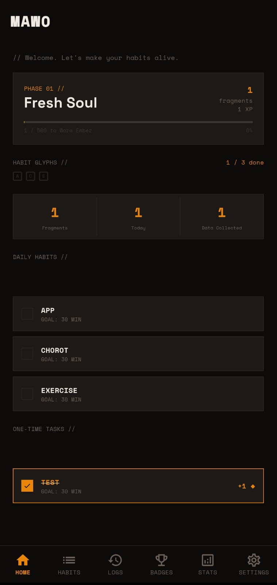
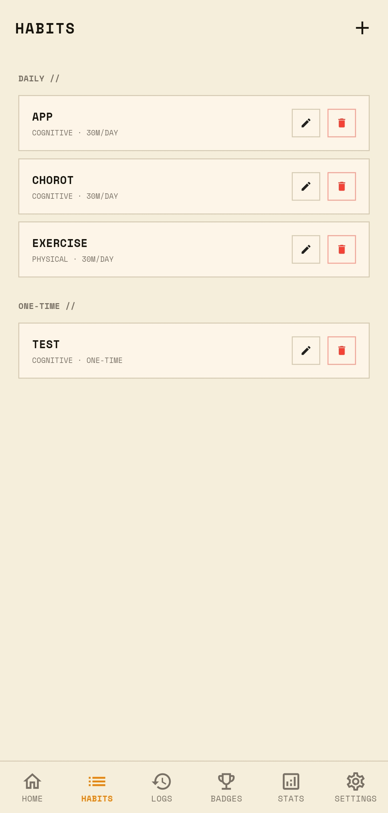
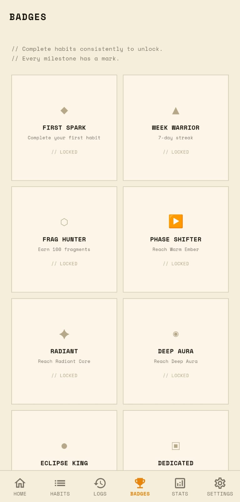
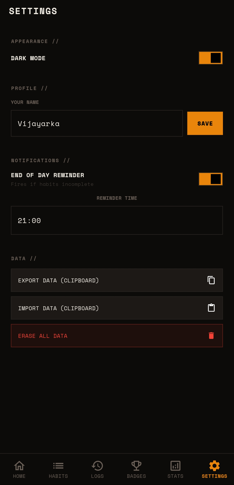

<div align="center">

```
███╗   ███╗ █████╗ ██╗    ██╗ ██████╗
████╗ ████║██╔══██╗██║    ██║██╔═══██╗
██╔████╔██║███████║██║ █╗ ██║██║   ██║
██║╚██╔╝██║██╔══██║██║███╗██║██║   ██║
██║ ╚═╝ ██║██║  ██║╚███╔███╔╝╚██████╔╝
╚═╝     ╚═╝╚═╝  ╚═╝ ╚══╝╚══╝  ╚═════╝
```

**Your Habits, Alive.**

[](https://github.com/thevijayarka/MAWO-Fixed/releases)
[](LICENSE)
[](https://flutter.dev)
[](#)
[](#)
[](#)

</div>

---

> Most habit apps look identical on day 1 and day 100.  
> That's not design — that's indifference.  
> MAWO is different. Your interface **evolves** as you do.

---

## // The Problem

Habit apps are broken. Here's why:

```
ERR_01 //  Checkboxes don't motivate
           Ticking a box gives zero emotional feedback.
           Completion without feeling isn't progress.

ERR_02 //  Streaks punish you
           Miss one day and everything resets.
           That's not motivation — that's anxiety with a productivity mask.

ERR_03 //  Static interfaces feel dead
           Your app looks the same on day 1 and day 100.
           A dead interface reflects nothing back at you.
```

---

## // The Solution — Alive UI

MAWO's interface **literally transforms** as you build consistency.  
Colors deepen. Glows emerge. Your world evolves through 5 phases.

| Phase | Name | Fragments |
|-------|------|-----------|
| 01 | Fresh Soul | 0 – 49 |
| 02 | Warm Ember | 50 – 149 |
| 03 | Radiant Core | 150 – 299 |
| 04 | Deep Aura | 300 – 499 |
| 05 | Eclipse King  | 500+ |

Your progress becomes the interface. Impossible to ignore.

---

## // Screenshots

<div align="center">

| Home |                          Habits |                            Badges |                            Settings |
|------|                         --------|                           --------|                           ----------|
|  |  |  |  |

</div>

---

## // How It Works

```
01  SET INTENTIONS   //  Create daily habits & one-time tasks.
                         Cognitive, physical, mental — categorized with intent.

02  EARN FRAGMENTS   //  Complete a habit, earn Fragments.
                         Build streaks, earn bonus XP. Every action has weight.

03  WATCH IT EVOLVE  //  5 phases of visual transformation.
                         Your progress becomes the interface.

04  COLLECT BADGES   //  First habit. 7-day streak. 100 fragments.
                         Every milestone earns a permanent mark.
```

---

## // vs Everything Else

| Feature | Standard App | MAWO |
|---------|-------------|------|
| Interface evolves with progress | ✗ | ✓ |
| Local storage only | ✗ | ✓ |
| No account needed | ✗ | ✓ |
| Works offline | ✗ | ✓ |
| Zero data collected | ✗ | ✓ |
| Research-backed | ✗ | ✓ |

---

## // The Research

MAWO is built on published neuroscience — not guesswork.

> *"Designing Alive UI in MAWO: Stimuli-Driven Interface Evolution for Habit Formation"*  
> — [Zenodo, 2025](https://zenodo.org/records/16889414)

Key findings:
- Visual environmental changes activate the brain's reward circuitry more effectively than numerical feedback alone
- Progressive interface evolution creates a sense of ownership over digital space — increasing habit adherence
- Multi-sensory feedback (color, depth, motion) triggers dopamine responses similar to game progression systems

---

## // Privacy — Your Data Stays Yours

```
100% LOCAL STORAGE   //  Nothing leaves your phone. No cloud. No breach risk.
WORKS OFFLINE        //  Full functionality, no internet required.
ZERO TRACKING        //  No analytics. No ads. No data brokers. Zero.
```

---

## // Download

<div align="center">

### [⬇ Download Latest APK](https://github.com/thevijayarka/theMAWO/releases)

</div>

---

## // Built With

- **[Flutter](https://flutter.dev)** — cross-platform UI framework
- **Dart** — language
- **Local storage only** — zero cloud dependencies, zero external SDKs

---

## // License

MIT — free forever, open forever.  
See [LICENSE](LICENSE).

---

## // Contributing

Pull requests are welcome.  
For major changes, open an issue first.

---

<div align="center">

*Built by [Vijayarka Nanduri](https://vijayarka.netlify.app) · Independent HCI Researcher*  
*[Website](https://mawo.netlify.app) · [Research Paper](https://zenodo.org/records/16889414) · [Portfolio](https://vijayarka.netlify.app)*

</div>
